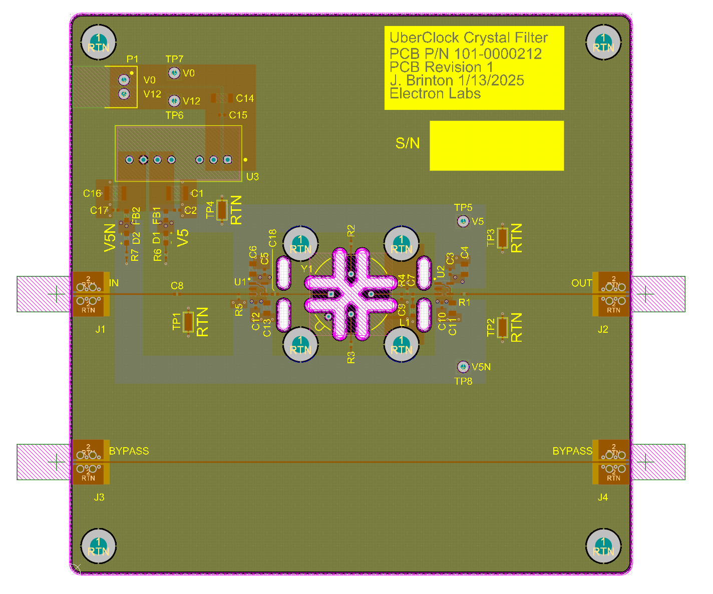
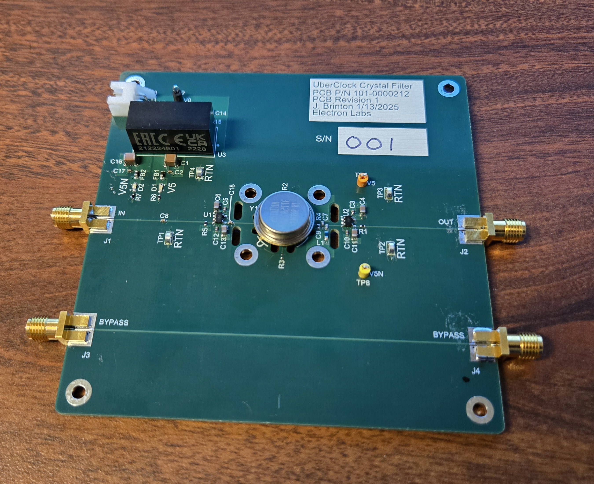
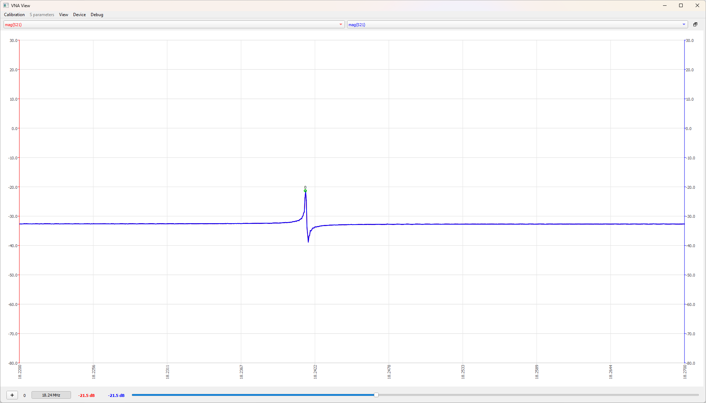
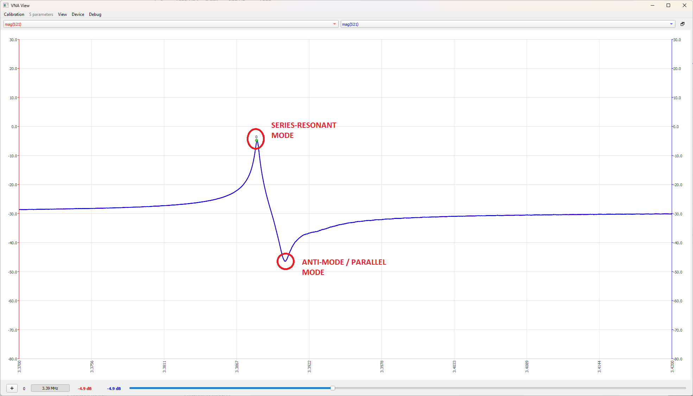
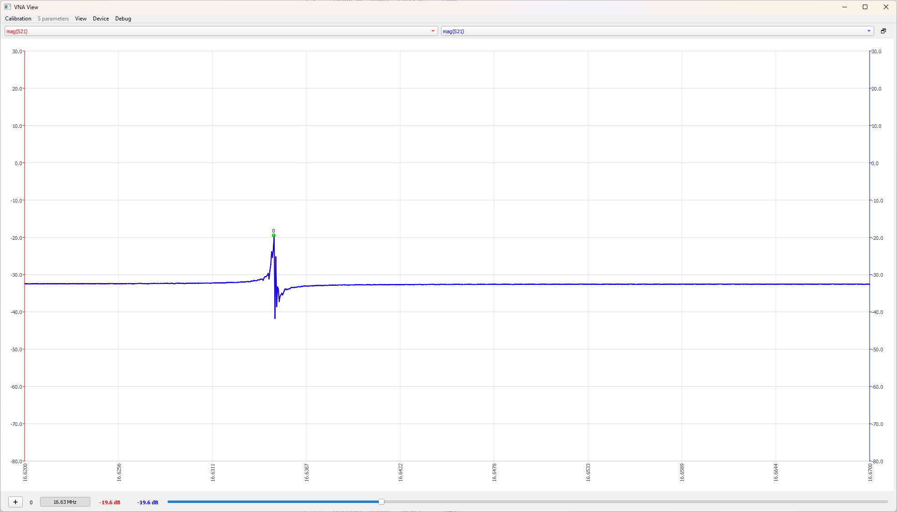

# UberClock PCB
This is the PCB design for the Crystal Filter for the UberClock multi-mode oscillator

# Details
Board dimensions: 100x100mm

Tools: Altium Designer Professional (23.11.1)

# Errata
1. Crystal resonator footprint wrong. Pin numbers are mirrored. Can be fixed by installing crystal at 90 degrees and connecting ground pin to closest mounting pad.

# Measurements

Measurements taken on NanoVNA V2 (https://nanorfe.com/nanovna-v2.html)

