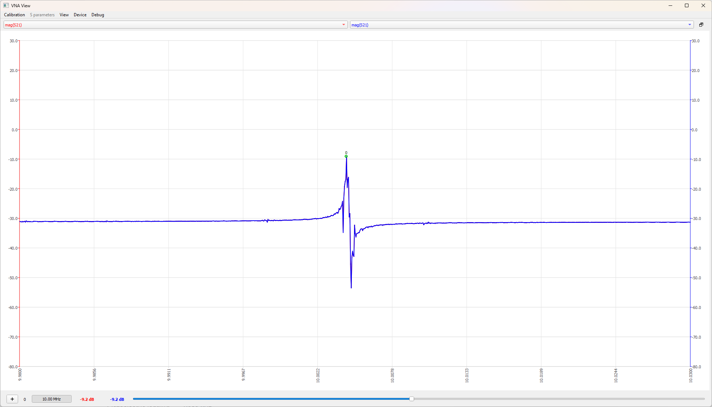

# UberClock PCB
This is the PCB design for the Crystal Filter for the UberClock multi-mode oscillator.

To download gerber files, schematics, or other documentation, see [Latest Release](https://github.com/jdbrinton/uberclock/releases).

# Details
Board dimensions: 100x100mm

Tools: Altium Designer Professional (23.11.1)

# Errata
1. See issue #1 for details and resolution. Crystal resonator footprint wrong. Pin numbers are mirrored.

# Measurements

Measurements taken on NanoVNA V2 (https://nanorfe.com/nanovna-v2.html)

